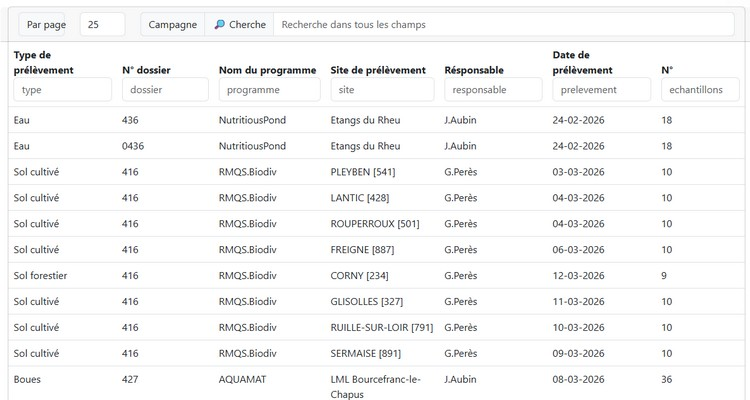

# Campagnes

l'écran campagnes est une liste (structure communes) :

**Par page** : premet de changer le nombre de lignes sur la page

Le champ **Cherche** : permet d'exécuter une recherche sur tous les champs des échantillons, alors que les cases de recherche sous le nom des colonnes permettent de filtrer les données sur la colonne concernée uniquement.

Cette liste est créer à partir des échantillons et permet de naviguer plus facillement dans ces dénières sans les "répetitions".

Enfin un **menu contextuel** est disponible en cliquant dur le bouton droit de la souris permettant de sélectionner des opérations adaptées à la ligne en question.

