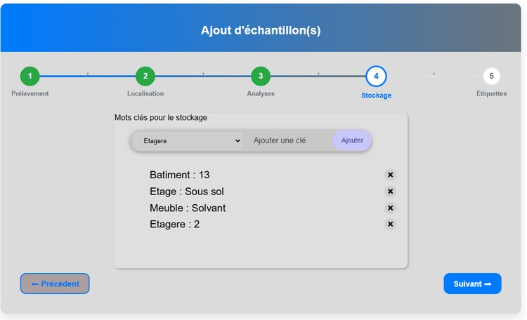

# Echantillons

l'écran échantillons est une liste (structure communes) :

**Par page** : premet de changer le nombre de lignes sur la page

Le bouton **Ajouter** permet de créer un ou plusieurs échantillons détaillés dans Ajouter.
Le bouton **Fichier Excel** permet d'importer un fichier Excel afin de créer plusieurs échantillons détaillés dans Importer.

Le champ **Cherche** : permet d'exécuter une recherche sur tous les champs des échantillons, alors que les cases de recherche sous le nom des colonnes permettent de filtrer les données sur la colonne concernée uniquement.

Le premier bouton de chaque ligne permet d'éditer l'échantillon de la ligne sélectionnée alors que le bouton vert éditera l'intégralité de la sélection en cours.

Le dernier bouton de chaque ligne permet d'imprimer l'étiquette de l'échantillon alors que le bouton ver imprimera toutes les étiquettes de la sélection.

Enfin un **menu contextuel** est disponible en cliquant dur le bouton droit de la souris permettant de sélectionner des opérations adaptées à la ligne en question.

## Ajout d'un échantillon

L'ajout d'un échantillon se déroule en 5 étapes

[Prélevement](#masque-1-prélèvement),
[Localisation](#masque-2-localisation),
[Analyses](#masque-3-analyses),
[Stockage](#masque-4-stockage),
[Etiquettes](#masque-5-etiquettes),

### Masque 1 Prélèvement

### Lors de la création toutes les données saisies formeront les données des échantillons MAIS ensuite chaque échantillon pourra être modifié indépendamment des autres.

- **Type de prélèvement** permet de séléctionner le type de prélèvement de(s) échantillon(s) crée(s) **ATTENTION** en cliquant sur suivant pour passer à létape suivante il ne sera plus possible de le changer.

- **Programme** Permet de sélectionner le programme concerné par le ou les échantillons une case à cocher est disponible afin de préciser s'il s’agit d'un programme pédagogique qui aura une gestion particulière, le nom de l'item change pour éviter toute ambiguïté.

- **Site de prélèvement** Le site de prélèvement indique le nom du site concerné par les échantillons si le site n’est pas présent dans la base des sites de l’application le site sera créé lors de l’étape suivante, notez qu'une liste est proposé dès lors qu'au moins 2 caractères sont saisis.

- **Identification** ce champ généré par l'application et non modifiable indique le code unique de l'échantillon constitué de la date de création Jour Mois Année Heure Minutes suivi du numéro d'échantillon sur quatre caractères (les blancs étant remplacé par des zéros).

- **Numéro de dossier** Indique le numéro de dossier interne.

- **N° de départ** Indique le numéro de départ de la numérotation des échantillons.

- **Nombre / Analyses** si nombre est coché (par default) il indique le nombre d'échantillons à créer si vous séléctionnez analyses cette case sera decocher et vous sera demandé de saisir une liste representant les analyses à effectuer sur chaque échantillon et le nombre d'analyse constituera le nombre d'échantillons à créer c'est a dire un par analyse notez que si vous modifiez la liste lors de l'étape "analyses" ce chiffre est mis a jour.

- **Date du prélevement** Indique la date du prélèvement "envisagée" elle sera modifiable ultérieurement.

- **Date de péremption** Indique la date de la péremption de l’échantillon qui sera mise à 5 ans par default elle sera modifiable ultérieurement.

- **Condition de prélèvement** indique les condition de prélevements.

- **Infos libre** Ligne de texte libre.

### Masque 2 Localisation

Le masque de la localisation est différé si le site saisi dans l'étape précédente est connu de l'application sinon vous avez la possibilité de le créer à cette étape malgré que le fait de passer par la gestion des sites est plus confortable avec une carte permettant une localisation plus sure.

#### Cas ou le site n'est pas reconnu.

- **Nom du site** Nom du site permetant l'identification lors des recherche.

- **Pays** Nom du pays.
- **Région** Région précise la région du site notez que si dans « région » vous saisissez le code postal à 5 ou à 2 chiffres, la région est automatiquement trouvée et le département apparaît sous la souris.

- **Latitude** et **Longitude** Indique la position au format WGS84 demandé par le e Registre Parcellaire Graphique (RPG), on remarque que tant que les données ne sont pas saisies le bouton RPG n’est pas utilisable et le bouton suivant reste sans effet.

- Le bouton **Créer** permet de créer le site.

#### Cas ou le site est reconnu.

Si le site est reconnu les champs sont bleuté indiquant qu’ils ne sont pas modifiables.

Dans le cas d'un échantillon de sol un bouton RPG apparait ce Button permet d'interroger Le Registre Parcellaire Graphique et d'afficher l'historique culturale.

Dans le cas particulier d'un échantillon de sol l'historique culturale apparait.

Dans le cas ou dans la configuration le passeport sanitaire est activé en plus d'un échantillon de sol l'historique culturale apparait ainsi qu'un message indiquant le niveau "d'expertise" du risque.

Dans le cas ou dans la configuration le passeport sanitaire est activé, qu'il s'agit d'un échantillon de sol et que la région de prélèvement est différente de celle du lieu indiqué dans la configuration l'historique culturale apparait, un message indiquant le niveau "d'expertise" du risque aussi et un bouton vous demandant de créer un passeport phytosanitaire.

Tant qu'il ne sera pas présent vous ne pouvez pas passer à l'étape suivante.

En cliquant sur le bouton le masque de saisie ci-dessous apparait : le nom du passeport interne est généré par l’application et il vous est demandé de joindre le document attestant de la prise de décision.

**NOTEZ** Si un passeport pour ce lieu à la même année est présent dans la base l'écran aurait été comme celui-ci après :

### Masque 3 Analyses

La saisie des analyses permet d’ajouter supprimer et réorganiser avec la souris grâce au glisser déposer. Les analyses seront gérées en fonction du choix Nombre / Analyses fait à l’étape une :

Dans le cas où nombre et sélectionné chaque échantillon se verra attribué toutes les analyses alors que si analyses est sélectionné l’application créera autant d’échantillon que d’analyse et chaque échantillon se verra attribué l’analyse en question

### Masque 4 Stockage

Cet onglet permet de gérer le stockage de l'échantillon, le système fonctionne avec un système de clé valeur les clés étant paramétré dans la configuration,
Il est possible aussi de réorganiser avec la souris grâce au glisser déposer

### Masque 5 Etiquettes

Enfin la dernière étape est le paramétrage de l'étiquette les éléments modifiables sont sélectionnable avec la souris (en passant dessus la couleur change en bleu ) et le choix influe sur les éléments de saisie :

- **Element** Permet de choisir un champ disponible à imprimer
- **Texte Libre** Permet d'écrire un texte à répliquer sur tous les échantillons
- **Taille** Change la taille du texte
- **Alignement** Défini l'alignement de la cellule

En cliquant sur Créer si tout se passe correctement l'application vous demandes si vous souhaitez imprimer les étiquettes :

